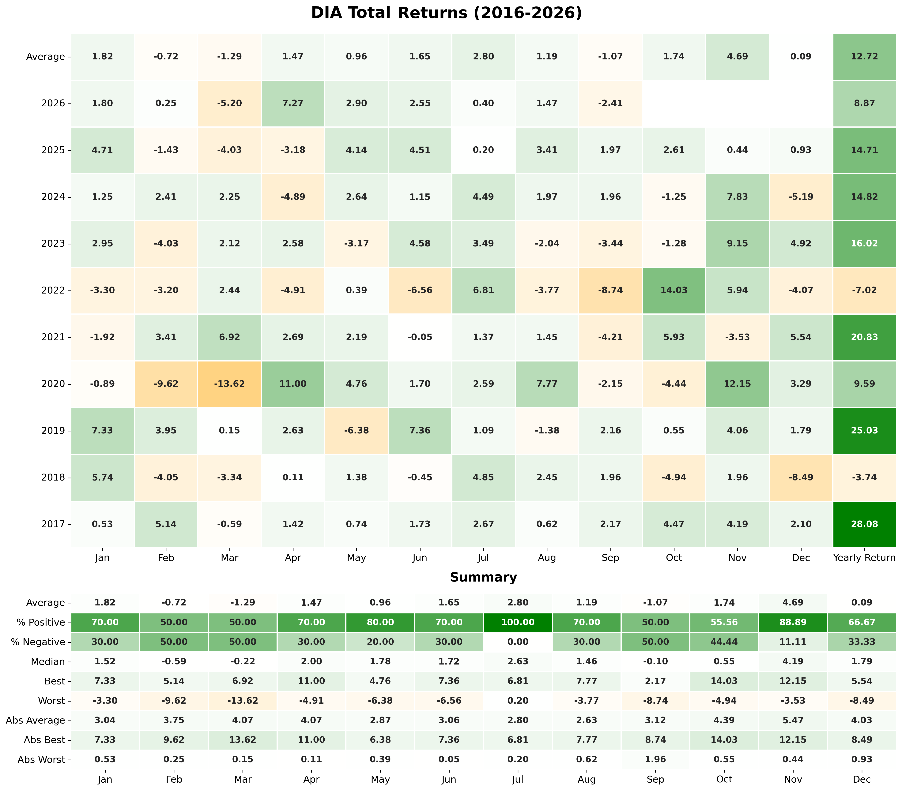

# market-rhythms
This is a **Streamlit** application for exploring historical patterns in stock and ETF performance.  
It downloads adjusted daily prices from Yahoo Finance and turns them into return tables, correlations, and interactive
seasonal strategy charts.  



The default ticker list includes DIA, GLD, QQQ, SPY, TLT, and USO.  

Users can add symbols and choose a date range from the sidebar.  

Cached price data is reused across analyses to reduce repeated downloads.

An **All** tab compares average monthly returns across tickers. Each ticker also
has six dedicated analysis tabs:

- **Heatmap:** Monthly and compounded yearly returns, plus summary statistics
  including averages, medians, positive and negative frequencies, and extremes.
- **Correlations:** Pearson correlations between calendar-month returns across
  matching years, requiring at least three shared years for each pair.
- **Time Series Decomposition:** Monthly closing prices separated into trend,
  seasonal, and residual components using an additive model with a 21-month cycle.
  This analysis requires at least 42 months of prices.
- **Sell in May:** Growth of $1,000 invested during November–April or May–October,
  compared with continuous buy-and-hold investing.
- **Santa Rally:** Returns from buying at the fifth-last December trading close
  and selling at the second January trading close, with win-rate and average-return
  statistics.
- **Weak Septemebr:** A comparison of skipping September with buy-and-hold.
  The tab retains this spelling in the application.

Chart titles identify the ticker, analysis, and selected years.  
Existing heatmaps use SVG rendering, while the four seasonal analyses use interactive **Plotly** charts.  

The **Save** button writes a combined PNG of the return and correlation charts
and separate interactive HTML files for the new analyses into the `charts` folder.  

The four standalone analysis scripts remain available and share their calculations
and Plotly chart functions with the application.

## Running the app

```bash
pip install -r requirements.txt
streamlit run st-returns-hm.py
```

Strategy comparisons exclude fees and taxes and assume no interest on cash.  
Incomplete years and the final month may show partial returns.  
Analyses with insufficient history display an explanatory message.  

